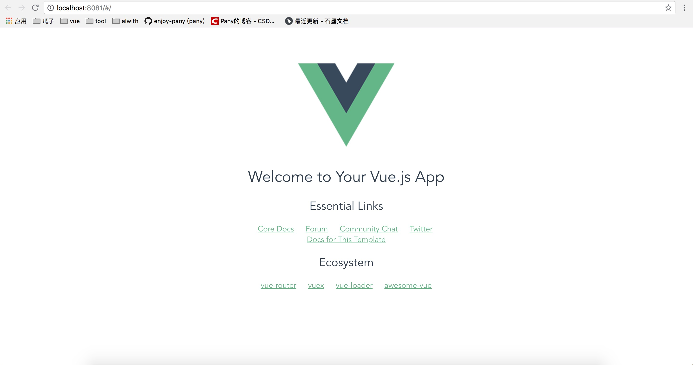
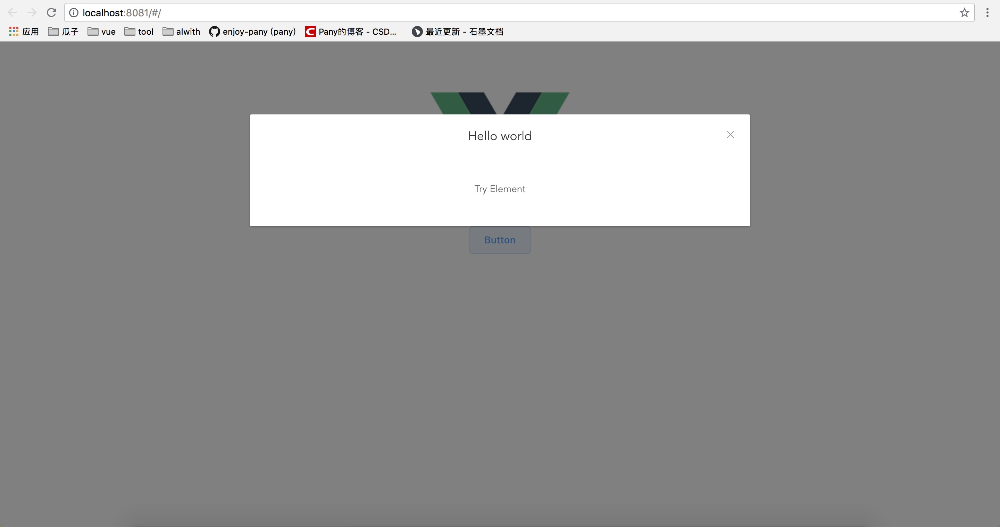

# sys
General system framework for vue

## Plan
目录结构
引入element
mock
proxy代理
api
vuex
router
userinfo
log/out
sso
权限


## Log
### 一、初始化git目录
	1. 生成 ssh-keygen -t rsa -C "xxx.xxx@xx.com" 
	2. cd ~/.ssh
	3. 复制 id_rsa.pub 内容 ==> GitHub -> settings -> ssh and GPG keys -> New ssh key
	4. git clone
	5. cd sys
	6. git checkout -b pany
	
### 二、引入vue-cli
	1. npm/cnpm install -g vue-cli
	2. vue init webpack //在当前项目目录 直接初始化
	3. npm/cnpm i
	4. npm run dev -> runing -> vue-cli done


	5. git add .
	6. git commit -m "init vue cli"
	7. git push origin pany

### 三、引入element-ui
	1. cnpm i element-ui -S
	2. main.js -> import ElementUI from 'element-ui'; import 'element-ui/lib/theme-chalk/index.css'
	3. Vue.use(ElementUI)
	4. HelloWord.vue
```
<template>
  <div class="hello">
    <el-button @click="visible = true">Button</el-button>
    <el-dialog :visible.sync="visible" title="Hello world">
      <p>Try Element</p>
    </el-dialog>
  </div>
</template>

<script>
export default {
  name: 'HelloWorld',
  data () {
    return {
      visible: false
    }
  }
}
</script>

<!-- Add "scoped" attribute to limit CSS to this component only -->
<style scoped>
</style>
```

	
	5. element-ui done

### 四、安装less
	1. cnpm install less less-loader style-loader --save
	2. build-> webpack.base.conf.js -> 
		{
		  test: /\.less$/,
		  loader: 'style-loader!css-loader!less-loader'
		}